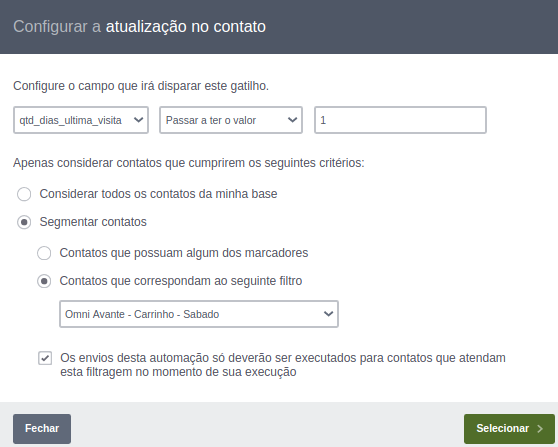
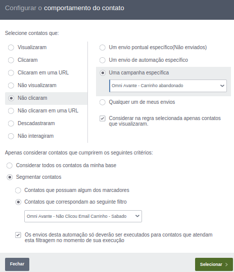
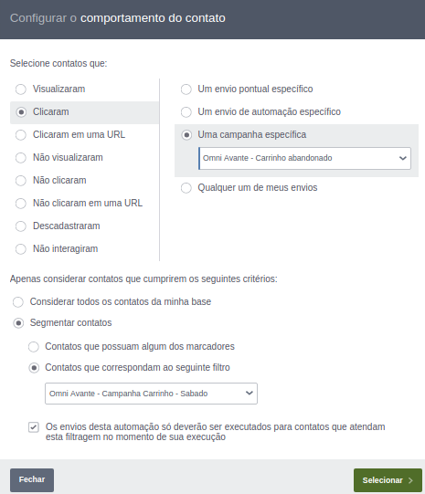
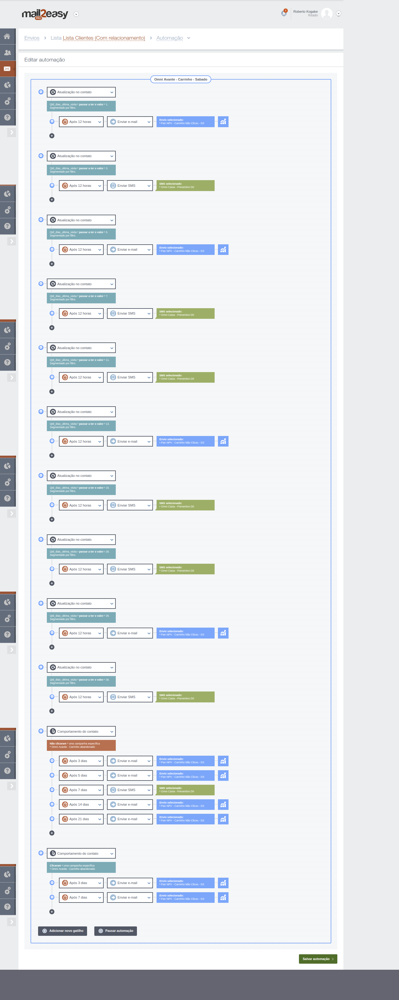

[Voltar a home](../../readme.md)
___

Automação Preventivo
======

## 1 Histórico do documento

Versão | Data | Comentário
---|---|---
1.0 | - | -

## 2 Sumário
  1. [Histórico do documento](#1-histórico-do-documento)
  2. [Sumário](#2-sumário)
  3. [Visão geral](#3-visão-geral)
  4. [Como funciona a automação de Carrinho Abandonado](#4-como-funciona-a-automação-de-carrinho-abandonado)

## 3 Visão geral

#### Responsáveis pelo projeto:

  - **Geração das querys e exportações**: Andre Petridis (Grego)
  - **Criação do processo no Ni-Fi**: Andre Petridis (Grego)
  - **Criaçao dos segmentos e réguas**: Roberto Keike Kogake

#### O que é?

  A automação dos disparos de e-mail Pontuais foi criada para melhorar a comunicação com os clientes finais (devedores) e o principal objetivo é diminuir o trabalho manual do squad de performance.

## 4 Como funciona a automação de Carrinho Abandonado

### Iniciando a automação
  O inicio da automação é através de uma query que busca todos os clientes que busca todos os clientes que acessaram o site da BLU365 (fizeram login) e não geraram o acordo e disponibiliza as informações em um SFTP onde a Dinamize/Mail2Easy Pro busca os arquivos em horários específicos.

### Importando os arquivos

  A ferramenta busca os arquivos sempre na mesma pasta, com o nome padrão e com horários pré definidos.
  Existe uma pasta no SFTP com os arquivos que serão importados:

 ###### Estrutura das pastas
 

### Importações criadas
  1. Todas as importações de preventivo tem o padrão de nome (dinamize_pontual1_**hora-da-importacao**.csv);
  2. Os arquivos são gerados de hora em hora;
  3. Os arquivos são importados de hora em hora.
 

 ###### Exemplo de importação do arquivo
 

### Segmentação de contatos

 As segmentações foram criadas para separar os contatos por **credor, portfolio, dias da semana ((segunda a sexta) e (sabado))**.
  * **CREDOR PORTFOLIO - Carrinho - Sabado**: segmenta os contatos que estão com o **marcador** = Carrinho Abandonado, **dia_da_semana** = 6.
  * **CREDOR PORTFOLIO - Campanha Carrinho - Sabado**: segmenta os contatos que estão com o **marcador** = Carrinho Abandonado, **dia_da_semana** = 6 e **contatos que participaram de uma campanha específica** = "CREDOR PORTFOLIO - Carrinho Abandonado".
  * **CREDOR PORTFOLIO - Não Abriu Email Carrinho - Sabado**: segmenta os contatos que estão com o **marcador** = Carrinho Abandonado, **dia_da_semana** = 6 e **contatos que não visualizaram uma campanha específica** = "CREDOR PORTFOLIO - Carrinho Abandonado".
  * **CREDOR PORTFOLIO - Não Clicou Email Carrinho - Sabado**: segmenta os contatos que estão com o **marcador** = Carrinho Abandonado, **dia_da_semana** = 6 e **contatos que visualizaram uma campanha específica** = "CREDOR PORTFOLIO - Carrinho Abandonado" e **contatos que não clicaram em uma campanha específica** = "CREDOR PORTFOLIO - Carrinho Abandonado".

### Automação dos disparos

  1. As automações foram criadas separadas para cada **credor + portfólio e dias da semana ((segunda a sexta) e (sabado))** com o nome **CREDOR PORTFOLIO - Carrinho - Segunda a Sexta**
  Exemplos: 
    * Omni Avante - Carrinho - Sabado
    * Pan NPV - Carrinho - Sabado
    * Pan NPV - Carrinho - Segunda a Sexta
    * NoVerde - Carrinho - Segunda a Sexta

  2. Gatilhos configurados:
  
    1. **Atualização no contato**: aguarda a atualização de um campo para executar suas ações, para essa automação foram utilizados gatilhos aguardando a atualização do campo **qtd_dias_ultima_visita** = (1, 3, 5, 7, 11, 13, 15, 20, 25, 30).
    2. **Comportamento do contato**: verifica as ações do contato em um e-mail, para essa automação foram utilizados dois deste gatilho, um para verificar se o contato clicou no e-mail e um para os contatos que não clicaram no e-mail.

  ###### Exemplo de configuração do gatilho **Atualização no contato**
  

  ###### Exemplo de configuração do gatilho **Comportamento do contato** - não clicaram
  

  ###### Exemplo de configuração do gatilho **Comportamento do contato** - clicaram
  

  3. Após a configuração do gatilho, é configurada a ação que do gatilho dispara (envio de e-mail ou SMS), conforme print abaixo:
  
  

## The end.
