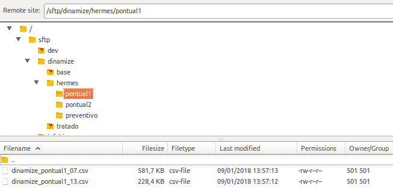
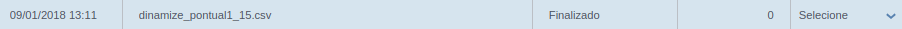
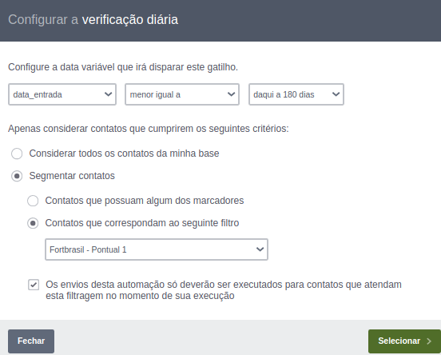
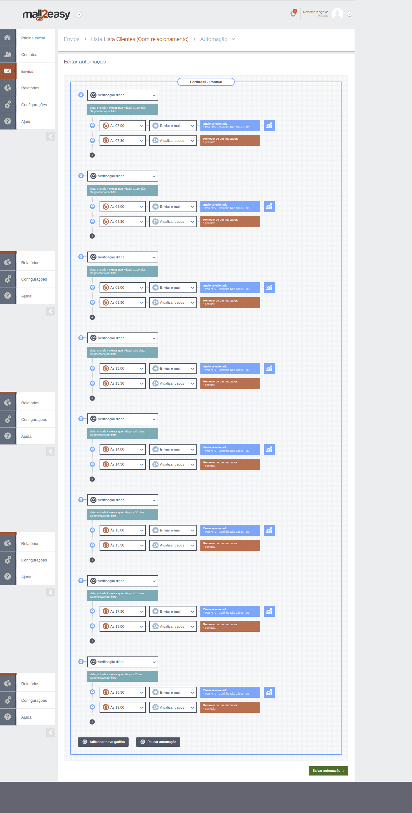

[Voltar a home](../../readme.md)
___

Automação Preventivo
======

## 1 Histórico do documento

Versão | Data | Comentário
---|---|---
1.0 | - | -

## 2 Sumário
  1. [Histórico do documento](#1-histórico-do-documento)
  2. [Sumário](#2-sumário)
  3. [Visão geral](#3-visão-geral)
  4. [Como funciona a automação do fluxo pontual](#4-como-funciona-a-automação-do-fluxo-pontual)
  5. [Alteração dos email a ser enviado](#5-alteração-do-email-a-ser-enviado)

## 3 Visão geral

#### Responsáveis pelo projeto:

  - **Geração das querys e exportações**: Andre Petridis (Grego)
  - **Criação do processo no Ni-Fi**: Andre Petridis (Grego)
  - **Criaçao dos segmentos e réguas**: Roberto Keike Kogake

#### O que é?

  A automação dos disparos de e-mail Pontuais foi criada para melhorar a comunicação com os clientes finais (devedores) e o principal objetivo é diminuir o trabalho manual do squad de performance.

## 4 Como funciona a automação do fluxo pontual

### Iniciando a automação
  O inicio da automação é através de uma query que busca todos os clientes que atendem os parâmetros definidos na condição "where" da query e disponibiliza as informações em um SFTP onde a Dinamize/Mail2Easy Pro busca os arquivos em horários específicos.

### Importando os arquivos

  A ferramenta busca os arquivos sempre na mesma pasta, com o nome padrão e com horários pré definidos.
  Existe uma pasta no SFTP com os arquivos que serão importados:

 ###### Estrutura das pastas
 

### Importações criadas
  1. Todas as importações do fluxo pontual tem o padrão de nome (dinamize_pontual1_**hora-da-importacao**.csv);
  2. Os arquivos são gerados sempre que o time de Performance rodar a query;
  3. Os arquivos são importados de hora em hora.
 

 ###### Exemplo de importação do arquivo
 

### Segmentação de contatos

 As segmentações foram criadas para separar os contatos por **credor e portfolio**.
  * **CREDOR PORTFOLIO - Pontual 1**: segmenta os contatos que estão com o **marcador** = pontual1.

### Automação dos disparos

  1. As automações foram criadas separadas para cada **credor + portfólio** com o nome **CREDOR PORTFOLIO - Pontual 1**
  Exemplos: 
    * Omni Avante - Pontual 1 
    * Pan NPV - Pontual 1
    * NoVerde - Pontual 1

  2. O gatilho que inicia a automação é o **Verificação diária**, todo dia, em um horário pre definido, o gatilho verifica se o contato atende os critérios configurados, conforme o print abaixo:

  ###### Exemplo de configuração do gatilho
  

  3. Após a configuração do gatilho, é configurada a ação que o gatilho executa.
     No print abaixo, foram configuradas duas ações para cada gatilho:
     1. Disparo de e-mail;
     2. Atualização do contato, para remover o marcador **pontual1**, essa ação é feita para que o disparo não seja feito várias vezes para o mesmo contato.
  
  

### Pontos de atenção
    
   1. Os e-mails que serão disparados devem ser alterados **ANTES** do horário da ação dos gatilhos;
   2. Os horários das ações podem ser alterados, mas a segunda ação (atualização do contato) deve acontecer sempre depois do disparo do e-mail;

## The end.
