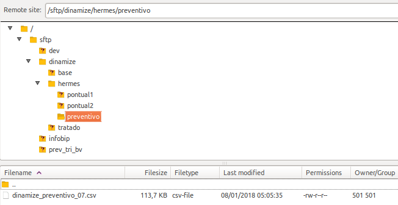
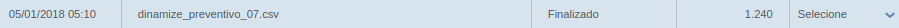

[Voltar a home](../../readme.md)
___

Automação Preventivo
======

## 1 Histórico do documento

Versão | Data | Comentário
---|---|---
1.0 | - | -

## 2 Sumário
  1. [Histórico do documento](#1-histórico-do-documento)
  2. [Sumário](#2-sumário)
  3. [Visão geral](#3-visão-geral)
  4. [Como funciona a automação do Preventivo](#4-como-funciona-a-automacao-do-preventivo)

## 3 Visão geral

#### Responsáveis pelo projeto:

  - **Geração das querys e exportações**: Andre Petridis (Grego)
  - **Criação do processo no Ni-Fi**: Andre Petridis (Grego)
  - **Criaçao dos segmentos e réguas**: Roberto Keike Kogake

#### O que é?

  A automação dos disparos de e-mail de Preventivo foi criada para melhorar a comunicação com os clientes finais (devedores) e o principal objetivo é diminuir o  percentual de queba de acordo e o trabalho manual do squad de performance.

## 4 Como funciona a automação

### Iniciando a automação
  O inicio da automação é através de uma query que busca todos os acordos gerados (primeira parcela e acordos gerados) e disponibiliza as informações em um SFTP  onde a Dinamize/Mail2Easy Pro busca os arquivos em horários específicos.

### Importando os arquivos

  A ferramenta busca os arquivos sempre na mesma pasta, com o nome padrão e com horários pré definidos.
  Existe uma pasta no SFTP com os arquivos que serão importados:

 ###### Estrutura das pastas
 

### Importações criadas
  1. Todas as importações de preventivo tem o padrão de nome (dinamize_preventivo_**hora-da-importacao**.csv);
  2. Os arquivos são gerados de hora em hora;
  3. Os arquivos são importados de hora em hora.
 

 ###### Exemplo de importação do arquivo
 

### Segmentação de contatos

 As segmentações foram criadas para separar os contatos por **credor, portfolio e dias para vencimento do boleto**.
  * **CREDOR - Preventivo D-5**: segmenta os contatos que estão com o **marcador** = Preventivo, **qtd_dias_vencimento** = -5 e **data_negociacao** <= ontem.
  * **CREDOR - Preventivo D-3**: segmenta os contatos que estão com o **marcador** = Preventivo, **qtd_dias_vencimento** = -3 e **data_negociacao** <= ontem.
  * **CREDOR - Preventivo D-1**: segmenta os contatos que estão com o **marcador** = Preventivo, **qtd_dias_vencimento** = -1 e **data_negociacao** <= ontem.
  * **CREDOR - Preventivo D0**: segmenta os contatos que estão com o **marcador** = Preventivo, **data_prox_venc** = hoje e **data_negociacao** <= ontem.

### Automação dos disparos

  1. As automações foram criadas separadas para cada **credor + portfólio** com o nome **CREDOR PORTFOLIO - PREVENTIVO**
  Exemplos: 
    .. * Omni Avante - Preventivo 
    .. * Pan NPV - Preventivo
    .. * NoVerde - Preventivo

  
